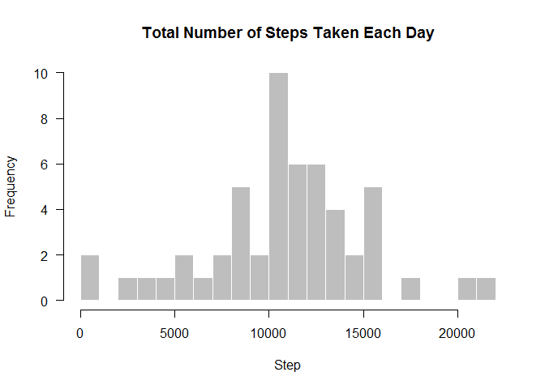
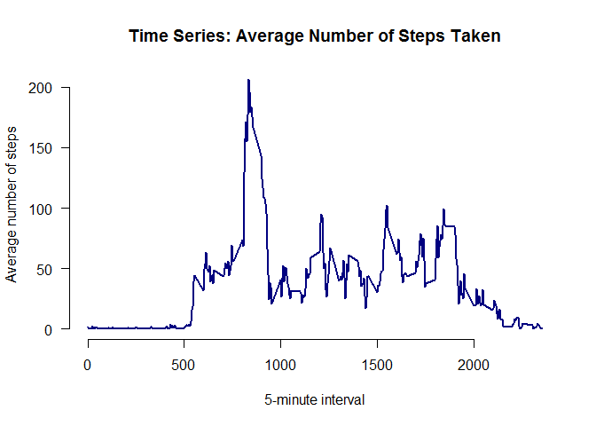
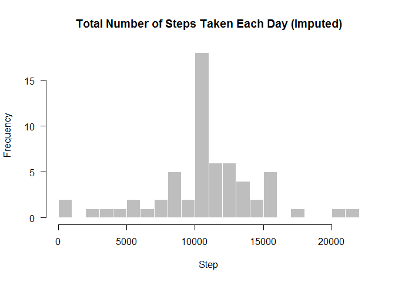
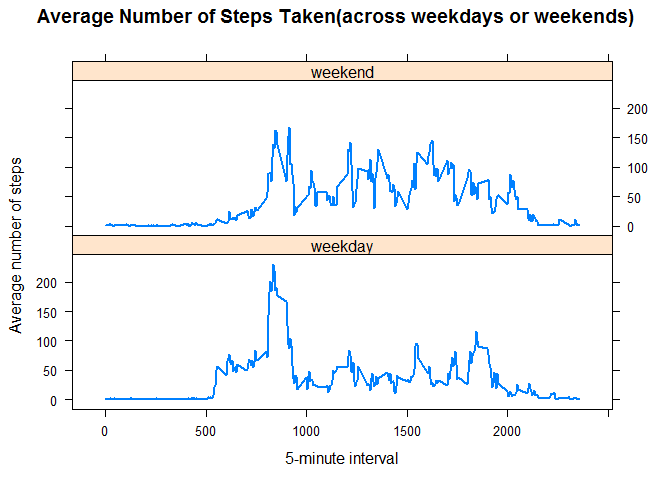

# Reproducible Research: Peer Assessment 1


## Loading and preprocessing the data

1. Load the data (i.e. read.csv())


```r
# Unzip the file and read the data
if(!file.exists('activity.csv')){
    unzip('activity.zip')
}
activity <- read.csv('activity.csv')
```

2. Process/transform the data (if necessary) into a format suitable for your analysis


```r
# Change the date format
activity$date <- as.Date(activity$date, format = "%Y-%m-%d")
```

## What is mean total number of steps taken per day?

For this part of the assignment, you can ignore the missing values in the dataset.

1. Calculate the total number of steps taken per day


```r
total_step <- aggregate(steps ~ date, data = activity, sum, na.rm = TRUE)
```

2. If you do not understand the difference between a histogram and a barplot, research the difference between them. Make a histogram of the total number of steps taken each day


```r
par(mfrow = c(1, 1))
# use base plotting system and more bins than the default setting
hist(total_step$steps, breaks = 20, 
     main = "Total Number of Steps Taken Each Day",
     col = "grey", border = "white", xlab = "Step", axes = FALSE)
axis(1)
axis(2, las = 1)
```

<!-- -->

3. Calculate and report the mean and median of the total number of steps taken per day


```r
meanSteps <- mean(total_step$steps)
medianSteps <- median(total_step$steps)
```

**The mean number of steps taken per day is 1.0766189\times 10^{4}**

**The median number of steps taken per day is 10765**

## What is the average daily activity pattern?

1. Make a time series plot (i.e. type = "l") of the 5-minute interval (x-axis) and the average number of steps taken, averaged across all days (y-axis)


```r
avg_step <- aggregate(steps ~ interval, data = activity, mean, na.rm = TRUE)
plot(avg_step$interval, avg_step$steps, type = "l", lwd = 2, col = "navy",
     main = "Time Series: Average Number of Steps Taken", axes = FALSE,
     xlab = "5-minute interval", ylab = "Average number of steps")
axis(1)
axis(2, las = 1)
```

<!-- -->

2. Which 5-minute interval, on average across all the days in the dataset, contains the maximum number of steps?


```r
averageSteps <- avg_step$interval[which.max(avg_step$steps)]
```

**The average steps taken per day is 835**

## Imputing missing values

Note that there are a number of days/intervals where there are missing values (coded as NA). The presence of missing days may introduce bias into some calculations or summaries of the data.


1. Calculate and report the total number of missing values in the dataset (i.e. the total number of rows with NAs)


```r
missingValues <- sum(is.na(activity))
```

**The number of missing values is 2304**

2. Devise a strategy for filling in all of the missing values in the dataset. The strategy does not need to be sophisticated. For example, you could use the mean/median for that day, or the mean for that 5-minute interval, etc.

Here I use the mean of 5-minute interval to fill in the values of the missing values.

3. Create a new dataset that is equal to the original dataset but with the missing data filled in.


```r
imp <- activity # new dataset called imp
for (i in avg_step$interval) {
    imp[imp$interval == i & is.na(imp$steps), ]$steps <- 
        avg_step$steps[avg_step$interval == i]
}
```

4. Make a histogram of the total number of steps taken each day and Calculate and report the mean and median total number of steps taken per day. Do these values differ from the estimates from the first part of the assignment? What is the impact of imputing missing data on the estimates of the total daily number of steps?


```r
total_step_imp <- aggregate(steps ~ date, data = imp, sum, na.rm = TRUE)
hist(total_step_imp$steps, breaks = 20, 
     main = "Total Number of Steps Taken Each Day (Imputed)",
     col = "grey", border = "white", xlab = "Step", axes = FALSE)
axis(1)
axis(2, las = 1)
```

<!-- -->

```r
meanImputed <- mean(total_step_imp$steps)
medianImputed <- median(total_step_imp$steps)
```


**The mean of number of steps taken per day (Imputed data) is 1.0766189\times 10^{4}**

**The median of number of steps taken per day (Imputed data) is 1.0766189\times 10^{4}**

## Are there differences in activity patterns between weekdays and weekends?

For this part the weekdays() function may be of some help here. Use the dataset with the filled-in missing values for this part.


1. Create a new factor variable in the dataset with two levels - "weekday" and "weekend" indicating whether a given date is a weekday or weekend day.


```r
imp$day <- weekdays(imp$date)
imp$week <- ""
imp[imp$day == "Saturday" | imp$day == "Sunday", ]$week <- "weekend"
imp[!(imp$day == "Saturday" | imp$day == "Sunday"), ]$week <- "weekday"
imp$week <- factor(imp$week)
```

2. Make a panel plot containing a time series plot (i.e. type = "l") of the 5-minute interval (x-axis) and the average number of steps taken, averaged across all weekday days or weekend days (y-axis). See the README file in the GitHub repository to see an example of what this plot should look like using simulated data.


```r
avg_step_imp <- aggregate(steps ~ interval + week, data = imp, mean)
library(lattice)
xyplot(steps ~ interval | week, data = avg_step_imp, type = "l", lwd = 2,
       layout = c(1, 2), 
       xlab = "5-minute interval", 
       ylab = "Average number of steps",
       main = "Average Number of Steps Taken(across weekdays or weekends)")
```

<!-- -->
